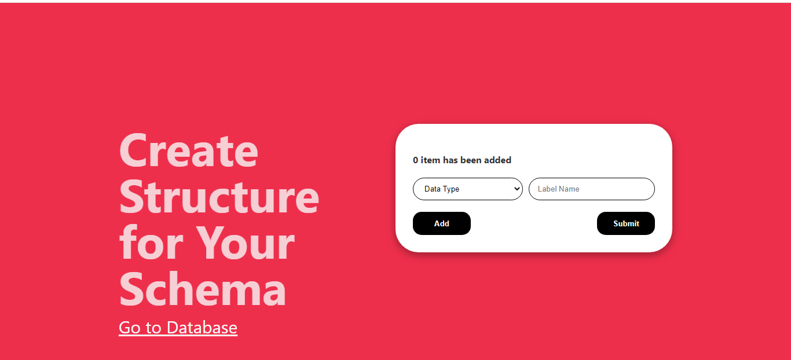
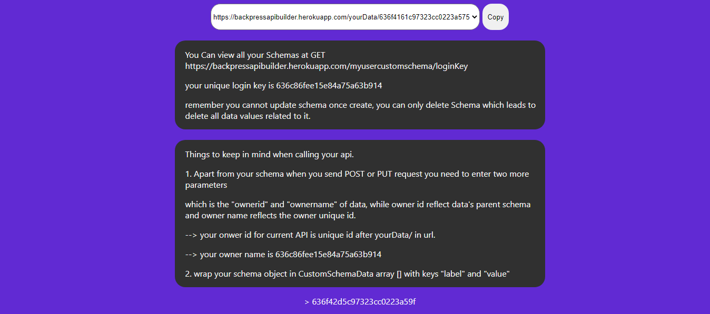

# Inspiration
I as a learning web development faces a lot of issues when building my api to make website interactive. its hard to write backend code and run the api.
that's why I build this website for people who are learning development can use this platform to be familiar with how to use api, how to call or send query to api.
and make their project interactive.

# What is does
BACKPRESS.com is platform that allow you to create your own custom api, database without having coding or backend development knowledge which you can use in your web or app to generate your own product in faster then 2 min. maggie.

# How it works
1. you go to the website, 
2. create your account.
3. you create your custom schema for your api.
4. the website will generate an api and unique key for your custom api.
5. now you can use that api to run CRUD operations in your website or application.
6. Not even this, On website you can easily manage all the data that has been posted by your user.

# How I build it
     frontend - typescript, react, html, css
     backend - typescript, nodejs, express
     api hosting- heroku
     database - mongodb 
     statemanagement and api call - redux toolkit
     
# Challenges I ran into
    making a platform like this was first time for me. I face my major challenges in building an api and writing algorithms for such product. time was little boud to actually complete it within 24 hours.
    
# Accomplishments that we're proud of
   Completing it under time
   successfully testing all cases of platform usage.
   
# What we learned
    I learned typescript a lot this, was first I have worked with typescript.
    
# what next for backpress
    There are lots of features I could have added if I would given some more time, but ya that's enough for beta version and in updates 
    I am going to add nested objects and nested array into the schema, 
    adding complete database management from website and work on security and authentications.
    
### website link - https://nobackend.vercel.app/
        
## API CALL UNDERSTANDING

### GET REQUEST- your_API/

### DELETE REQUEST- your_API/unique_id_of_single_document

### PUT REQUEST- your_API/unique_id_of_single_document

### GET SINGLE DOCUMENT REQUEST - your_API/unique_id_of_single_document

## API PUT/POST REQUEST UNDERSTANDING
when you send a POST/PUT request to your api you should follow a website policy and structure.
-> 1. you need to wrap your schema object inside "CustomSchemaData" array<object>[] with keys of 
      label and value.
-> 2. you also need to add two more parameters "ownerid" your api end unique point and "ownername" your unique name 
      
      for eg. let say your api has 3 parameters such name, email and password of String data type.
      then your body of POST/PUT request should be.
      { 
        "CustomSchemaData": [
            {
               "label": "name",
               "value": "hello world"
            },
            {
               "label": "email",
               "value": "world@2022.com"
            },
            {
               "label": "password",
               "value": "password_world"
            }
        ],
        "ownerid": endpoint of your_api/${endpoint},
        "ownername": by_default_generated_by_website_on_database_page
      }

## Authors

- [@abhijain2003](https://github.com/abhijain2003)

## Screenshots

